<h1>CSAN E-Commerce Webiste</h1>

    
CSAN is an E-Commerece website for B2C, the purpose of the site is to sell new adjustable technology blinds directly to consumers instead of paying someone else so sell them.  
    <a href="https://csan.herokuapp.com/">Click Here</a> to go to the live website.

This website follows the mobile first approach and is responsive for mobile devices as well as desktop.

<h1>Planning</h1>

<h2>Storyboard used <a href="https://github.com/users/Jca-Dev/projects/4">Here</a></h2>

I used balsamiq wireframes to plan the look and layout of the project. however the final result is not exactly the same as the wireframes.

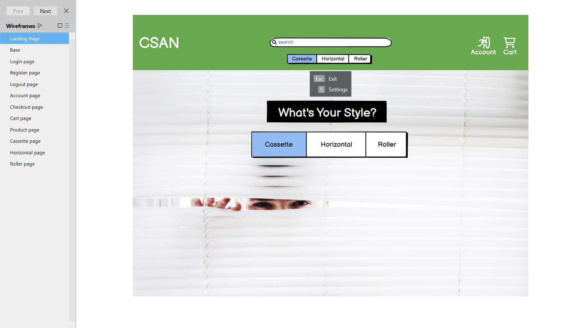

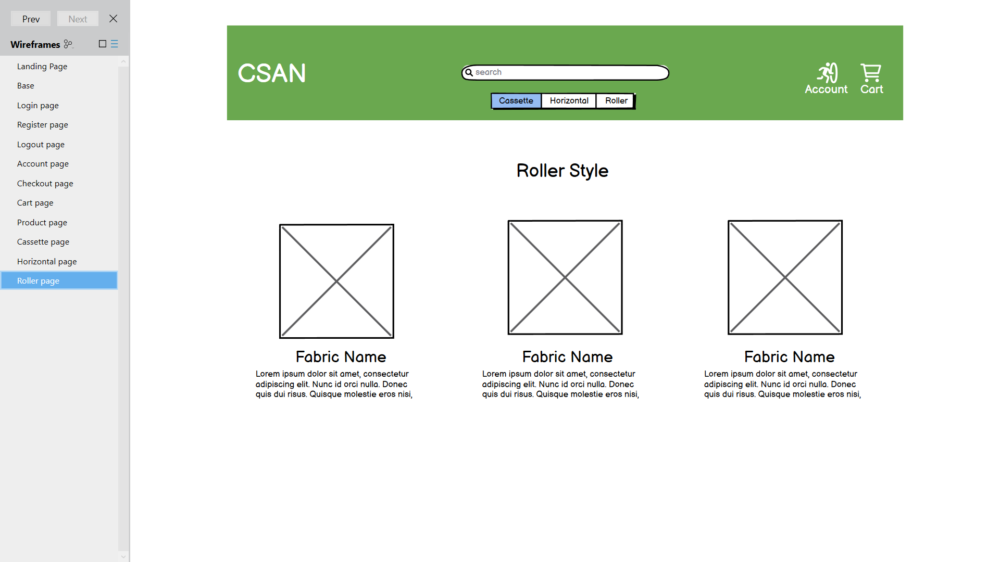

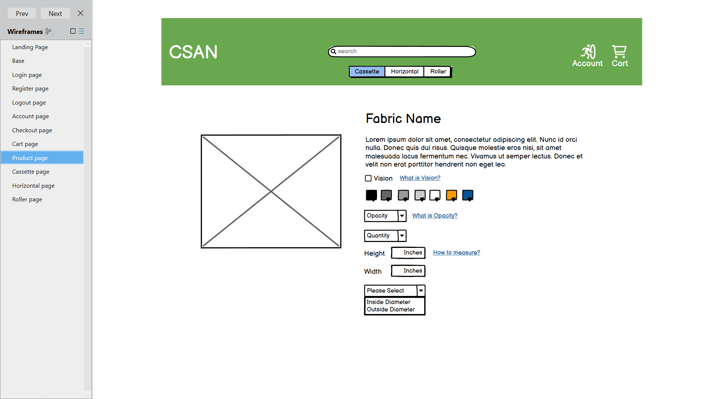

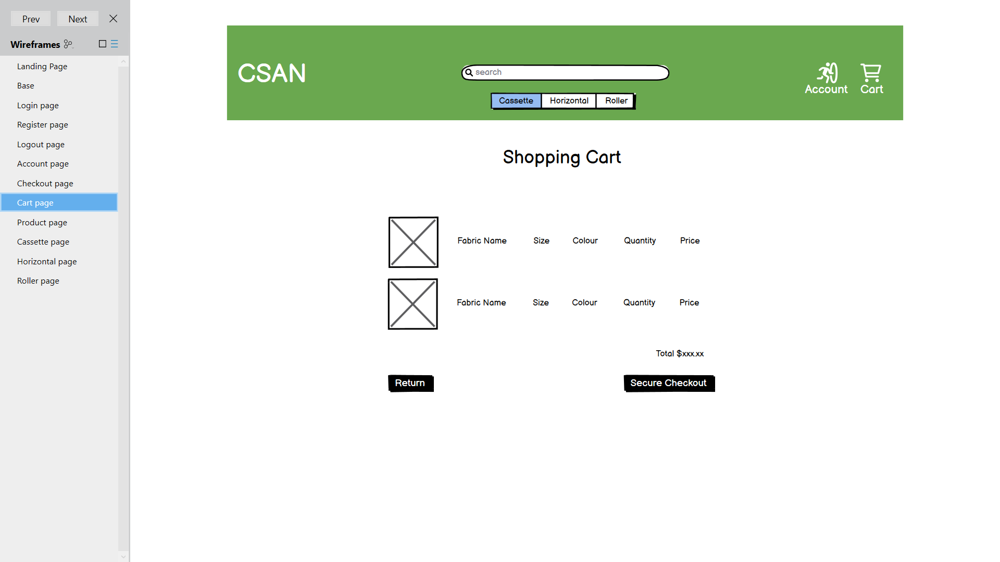

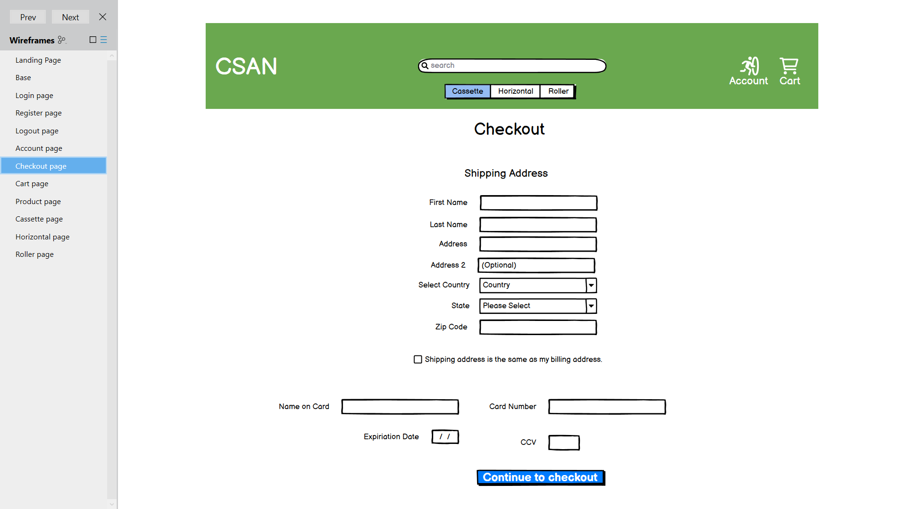

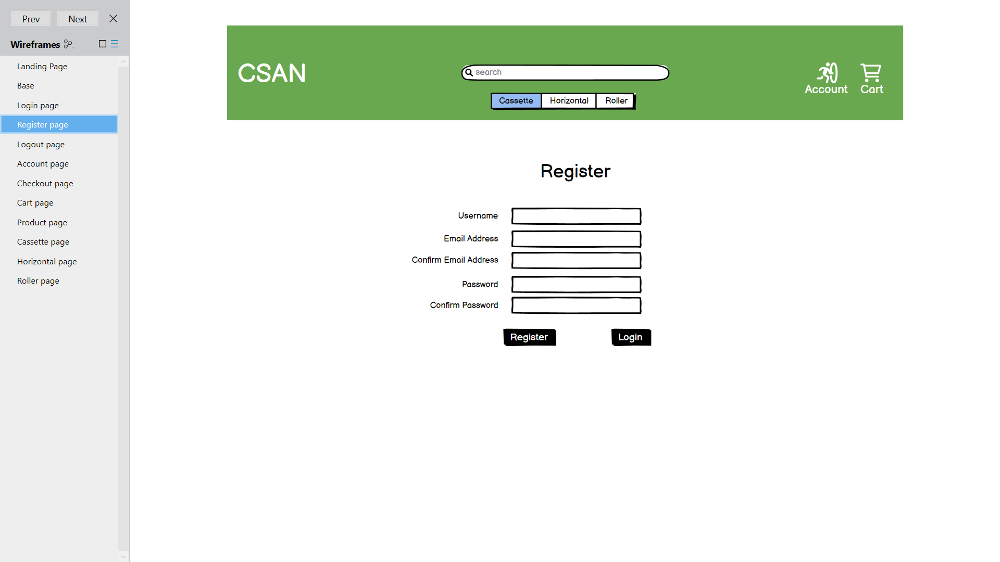

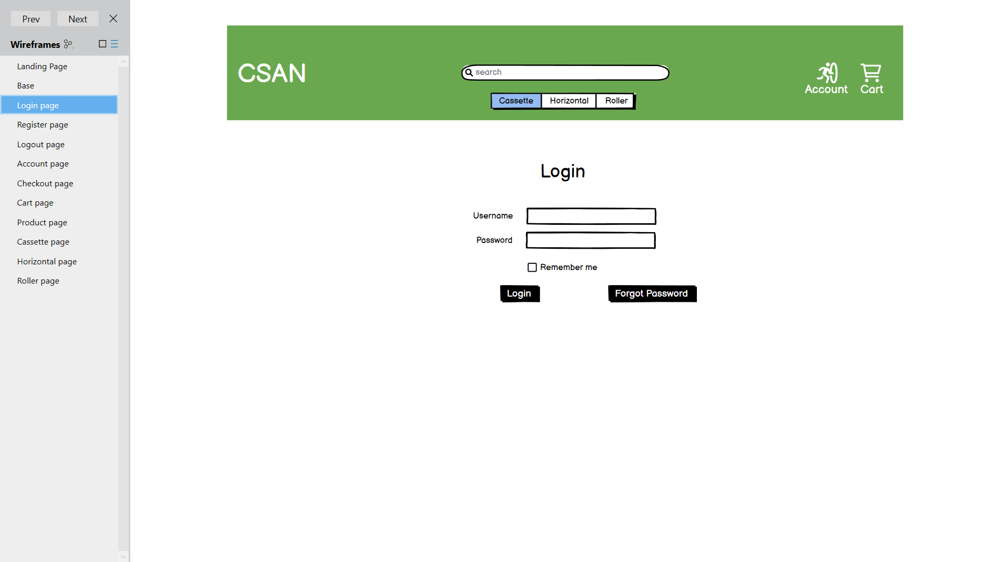

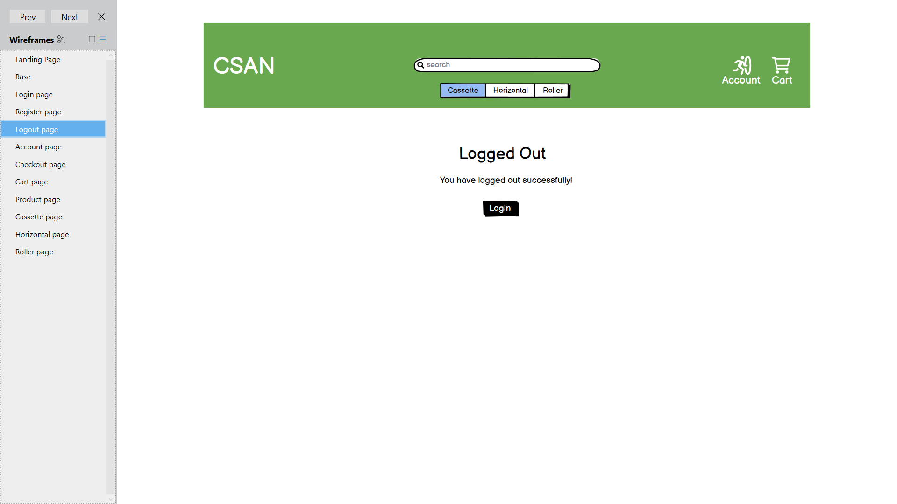

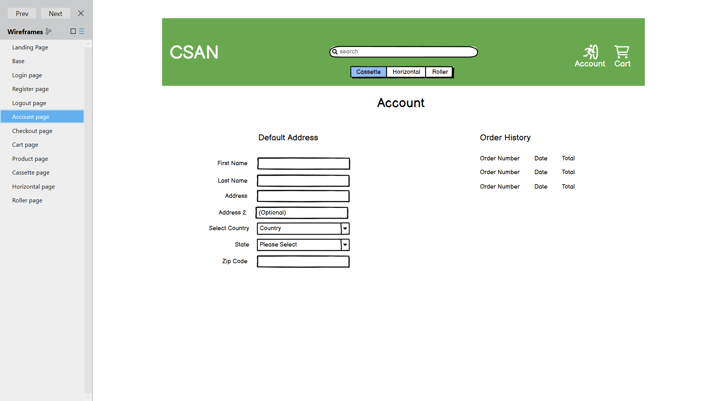

<h1>Design And Features</h1>
<ul>
    <li>Customers can create an account and have their own profile to store their address details for checkout purposes, leave product reviews and view their order history.</li>
    <li>Customers can log in with google Oauth for a fast user friendly registration experience.</li>
    <li>Staff accounts have CRUD functionality over products on the web page and can also log into the dJango admin pannel.</li>
    <li>There are links on the main page to relative information on blind cleaning and types of blinds.</li>
</ul>
<h2>Imagery</h2>
<ul>
    <li>The main background image is a bright picture of someone peering through a blind, I thought this would be relative as its a picture of a product sold in the store.</li>
</ul>
<h2>Site colors</h2>
<ul>
    <li>The color sheme is green, white and black. Green and white are the brand colors whereas black is the contrasting color for user interaction buttons to be easily seen.</li>
</ul>

<h2>Font styles</h2>
<ul>
    <li>Raleway - is used for headings and the logo because it gives a clear crisp design.</li>
    <li>Open Sans - is used for the text body to align with the heading clear design.</li>
</ul>

<h2>Navigation</h2>

The user navigates through the site with the buttons on screen and the navbar on the top which also has a search bar.  
The user will know where they are on the site as each page has a header displaying the page name. apart from the landing page.

<h2>Future features</h2>
<ul>
    <li>I would like to implement more of the items shown in the product detail page from the wireframes. having a color selector for each blind and multiple pictures of the products.</li>
</ul>

<h1>Marketing</h1>

I created a facebook marketing page for reaching potential and existing customers on a popular platform. However this has been taken down by facebook as it's not a genuine business.  
The footer has links to social media pages, if this was a real business then they would link to the social pages of the business.
  Mailchimp has a newsletter popup for new visitors to the site so they can subscribe their email for news letters and marketing campaigns.

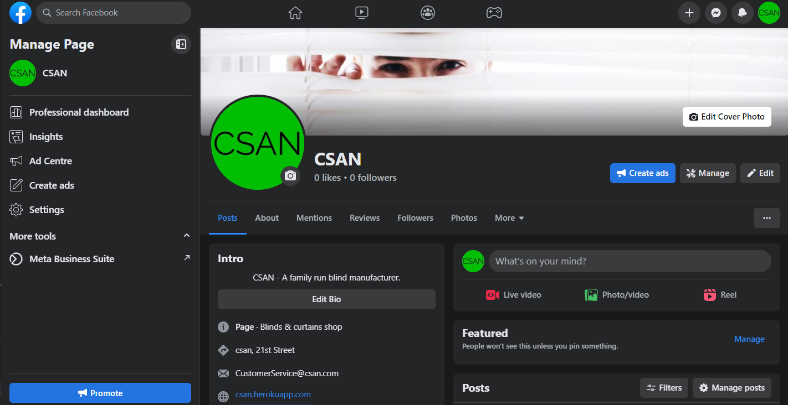

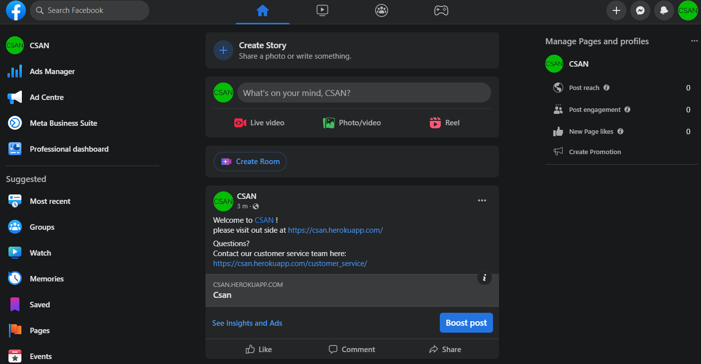

<h1>Legal Info</h1>

The footer has links to the privacy policy and copyright notice.  
There is also a cookie consent popup that also links the privacy policy and controls cookies plus tracking to comply with GDPR.

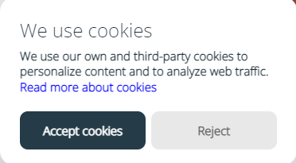

<h1>Technologies Used</h1>
<ul>
    <li>Python 3 - coding language.</li>
    <li>Django - coding framework.</li>
    <li>HTML & CSS - markup language.</li>
    <li>Bootstrap 5 - CSS framework and toolkit.</li>
    <li>JavaScript - coding language.</li>
    <li>jQuery - coding framework.</li>
    <li>Stripe - stripe payment and webhooks</li>
    <li>Git - version control by utilizing the Gitpod terminal to add, commit and Push to GitHub.</li>
    <li>Git Hub - stores the project code and hosts the website.</li>
    <li>Visual Code Studio - system used to write code via Git.</li>
    <li>Paint 3D - to create the logo and edit screenshots for the README.md</li>
    <li>Heroku - for hosting the python code and downloading requirements.</li>
    <li>Pep8 - testing code.</li>
    <li>Chrome Dev Tools - to action, review and test changes without having to commit and push to the website each time.</li>
    <li>Lighthouse - testing code.</li>
    <li>W3C Validation - testing code.</li>
    <li>AWS - amazon hosting service S3 hosts the required static files.</li>
    <li>Database - elephantSQL.</li>
    <li>Mailchimp - hosting user email address data for newsletters.</li>
    <li>Pytest - Automated testing.</li>
    <li>Coverage - Automated testing.</li>
    <li>Factory-boy - Automated testing.</li>
</ul>

<h1>Deployment</h1>
<h2>Heroku</h2>
The project was deployed to Heroku via GitHub by:
<ol>
    <li>Logging Into Heroku, creating a new project, going to the settings page and adding the variables for my database and AWS with all enviroment keys ect.</li>
    <li>Going to deploy, selecting deployment method as GitHub and typing in the GitHub repository name.</li>
    <li>Finally selecting deploy branch to manually deploy or select automatic deployment which allows Heroku to rebuild the project after each push to GitHub.</li>
</ol>
The page is now published and the link is in the settings section under Domains.

 

<h2>Making a Local Clone</h2>
<ol>
<li>Log in to GitHub and locate the [GitHub Repository](https://github.com/)</li>
<li>Under the repository name, click "Clone or download".</li>
<li>To clone the repository using HTTPS, under "Clone with HTTPS", copy the link.</li>
<li>Open Git Bash</li>
<li>Change the current working directory to the location where you want the cloned directory to be made.</li>
<li>Type `git clone`, and then paste the URL you copied in Step 3.</li>
<li>Press Enter. Your local clone will be created.</li>
<li>Create a new Heroku app and follow the steps in Heroku deployment above.</li>
</ol>

Click [Here](https://help.github.com/en/github/creating-cloning-and-archiving-repositories/cloning-a-repository#cloning-a-repository-to-github-desktop) for retrieve pictures and more detailed explanations of the above process.
    

<h1>Testing</h1>
<h2>Manual test</h2>
<ul>
    <li>Given invalid input such as letters and incorrect amount of data, both resulting in a error message as expected.</li>
    <li>Tried submitting blank forms resulting in error messages as expected.</li>
</ul>
<h2>Browsers</h2>
<ul>
    <li>Google Chrome</li>
    <li>Microsoft Edge</li>
    <li>Mozilla Firefox</li>
</ul>
<h2>Devices</h2>
<ul>
    <li>Galaxy S8</li>
    <li>Galazy S21 Ultra</li>
    <li>Iphone SE</li>
    <li>Iphone 4</li>
    <li>Iphone 12 Pro</li>
    <li>Ipad Air</li>
    <li>Surface Pro 7</li>
    <li>Laptop</li>
    <li>Nest Hub max</li>
</ul>

<h2>Software Tests</h2>
<ul>
    <li><a href="https://search.google.com/test/mobile-friendly" target="_blank" rel="noopener">Google mobile friendly test Service</a></li>

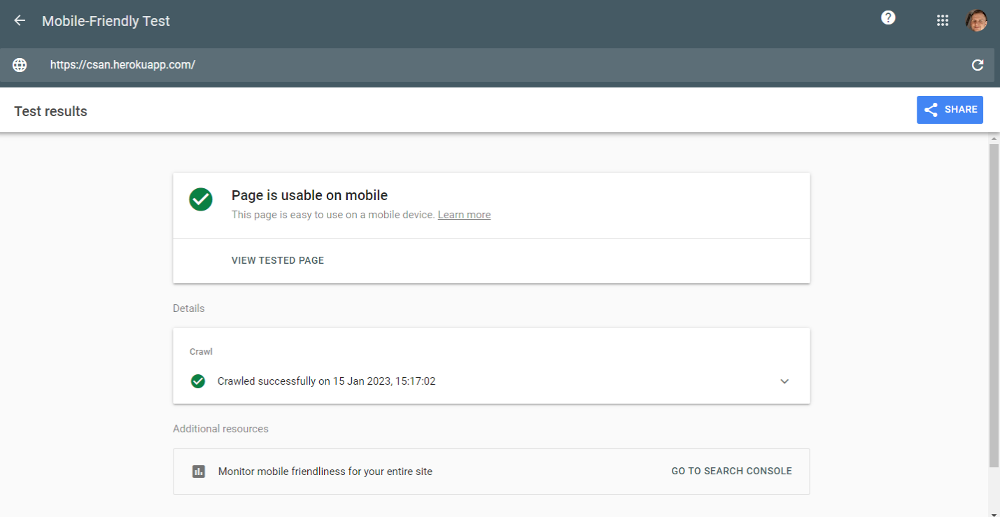
    <li><a href="https://validator.w3.org/" target="_blank" rel="noopener">W3C Markup Validation Service</a></li>

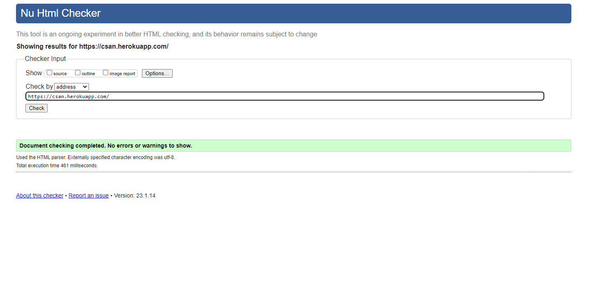
    <li><a href="https://jigsaw.w3.org/css-validator/" target="_blank" rel="noopener">W3C CSS Validation Service</a></li>

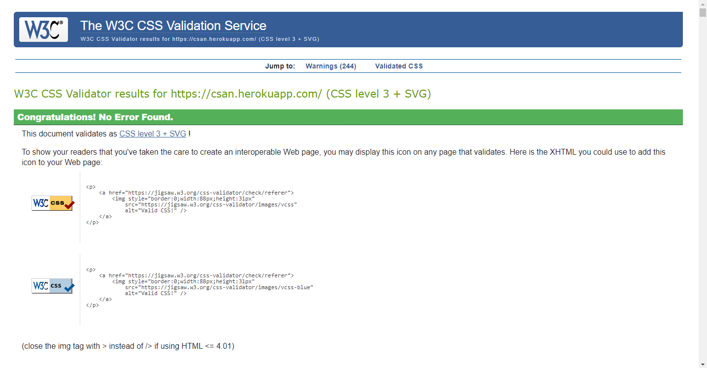
    <li><a href="https://developers.google.com/web/tools/lighthouse" target="_blank" rel="noopener">Google Chrome Lighthouse</a></li>

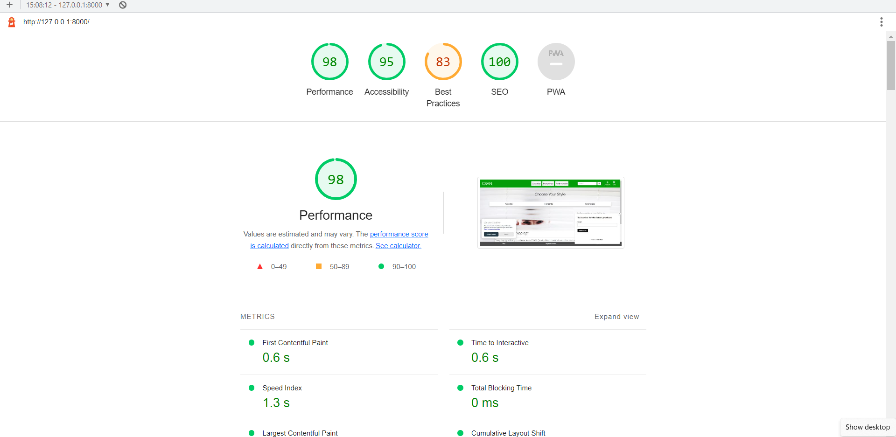
    <li><a href="https://jshint.com/" target="_blank" rel="noopener">JSHint Javascript Validation Service tested javascript including third party.</a></li>
</ul>
<h2>Unit Tests</h2>
I used Coverage to Identify tests needed.

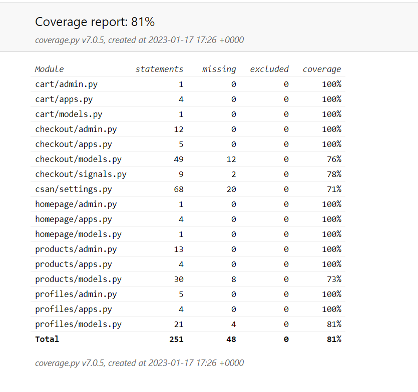

Automated testing showed me that I forgot to add webhook files and email templates and I changed my form validation on the phone number form field to be more user friendly by changing it to a charfield to take advantage of the max_value validator then I used RegexValidator to make sure the user inputs numbers.

<h2>Bugs & Fixes</h2>
<ul>
   <li>The screen width on mobiles wasn't showing 100% so the nav bar and content was off the screen and you had to scroll across to see it. - fix - with setting up 100vw in body and html inside base.css.</li>
   <li>The monkeychimp modal for mobile was covered by the nav bar so users couldnt see it properly or exit it easily. - fix - reduced z-index of nav bar to 50 so it was below monkeychimp modal z-index.</li>
</ul>

<h2>Known Bugs</h2>
<ul>
    <li>The Error: Uncaught TypeError: Cannot read properties of null (reading 'appendChild') this is present in a third party script from mailchimp that I dont have access to.</li>
    <li>The checkout form validation doesn't show up on the fields apart from the stripe payment field. but it does validate.</li>
</ul>

<h2>Sources/Credits</h2>

<ul>
    <li>My Mentor for her feedback</li>
    <li>Gathered information and troubleshooting from <a href="https://stackoverflow.com/" target="_blank" rel="noopener">Stackoverflow</li>
    <li>Code Institute's Boutique_ado walkthrough provided a very clear idea on how to create an E-commerce Website in dJango.<a href="https://github.com/Jca-Dev/Love_sandwiches" target="_blank" rel="noopener">GitHub Link</a></li>
    <li>background image from <a href="https://www.pexels.com/" target="_blank" rel="noopener">Pexels</a></li>
    <li>Icons from <a href="https://fontawesome.com/search?o=r&m=free" target="_blank" rel="noopener">fontawesome</a></li>