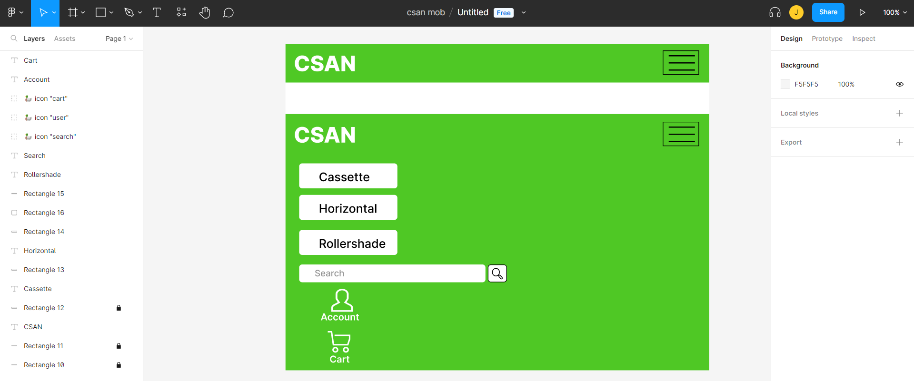
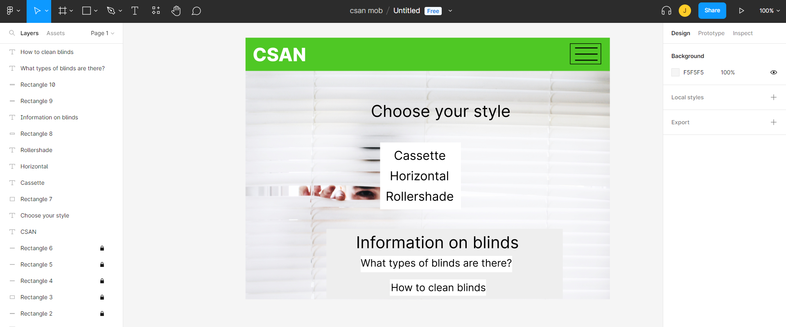
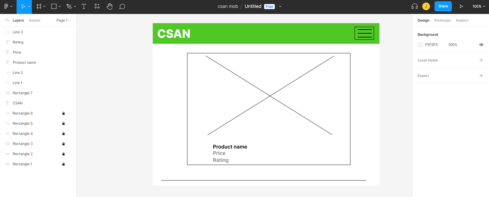
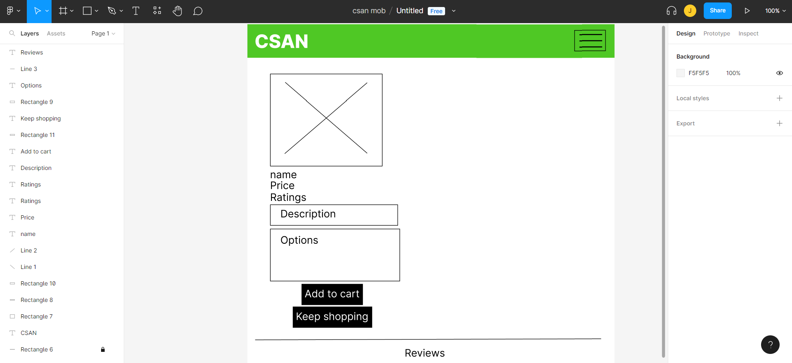
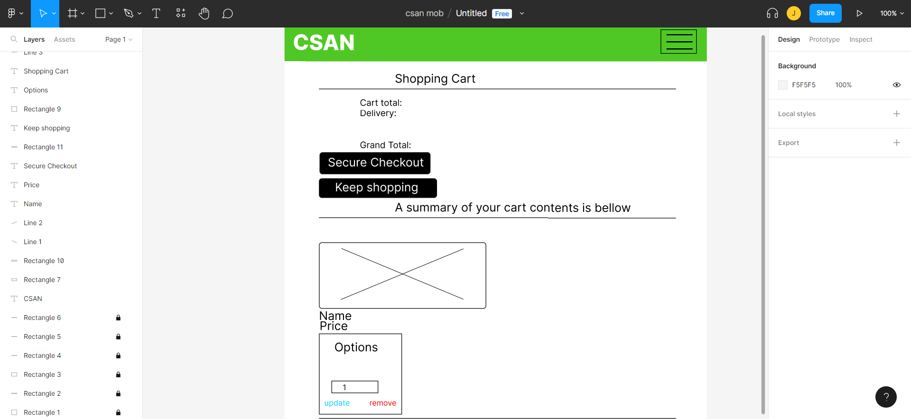
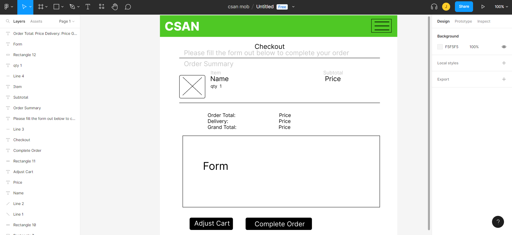
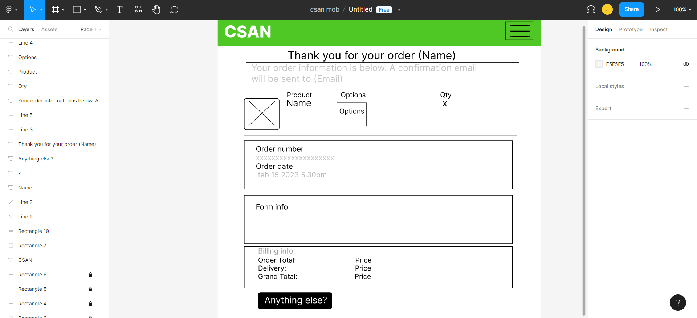
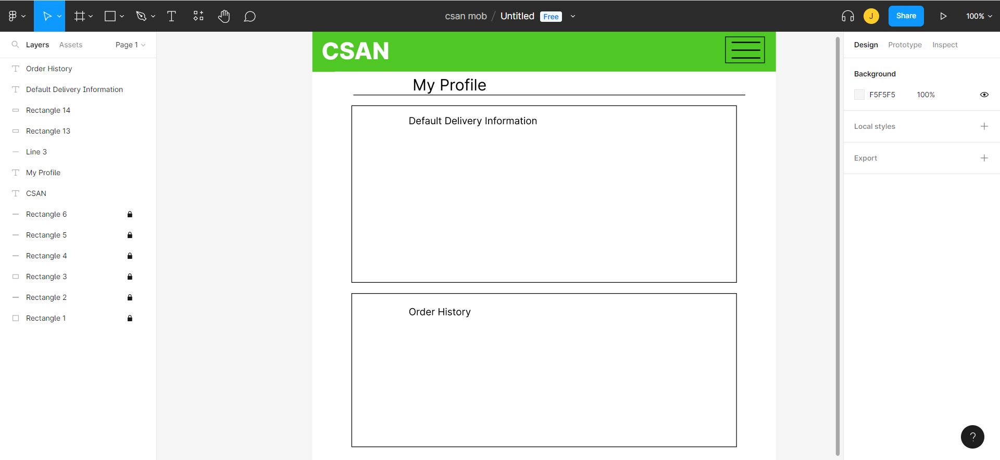

<h1>CSAN E-Commerce Webiste</h1>

    
CSAN is an E-Commerece website for B2C, the purpose of the site is to sell blinds directly to consumers instead of paying third party so sell them.  
    <a href="https://csan.herokuapp.com/">Click Here</a> to go to the live website.

This website follows the mobile first approach and is responsive for mobile devices as well as desktop.

<h1>User Experience (UX)</h1>
<h2>Goals</h2>
<ul>
    <li>Users can easily find and purchase blinds online.</li>
    <li>Show a clean, clear, accessible and easily navigable website for the user.</li>
    <li>Users return to show/recommend service to others.</li>
    <li>Frequent users connect via the social media platforms for information and updates.</li>
    <li>Users give positive feedback in the form of reviews and testimonials.</li>
</ul>

<h1>Planning</h1>

<h2>Storyboard used <a href="https://github.com/users/Jca-Dev/projects/4">Here</a></h2>

<h2>Desktop</h2>

I used balsamiq wireframes to plan the look and layout of the project. however the final result is not exactly the same as the wireframes.

<h2>Mobile</h2>

For the mobile design I used figma wireframes because my balsamiq trial had ended.
I also used blocks for forms and informaion to use the layout and reference the block info from the desktop view.

Above is the nav bar expanded and closed for mobile view.

<h1>Design And Features</h1>
<ul>
    <li>Customers can create an account and have their own profile to store their address details for checkout purposes, leave product reviews, testimonials and view their order history.</li>
    <li>Customers can log in with google Oauth for a fast user friendly registration experience.</li>
    <li>Staff accounts have CRUD functionality over products on the web page and can also log into the dJango admin pannel.</li>
    <li>There are links on the main page to relative information on blind cleaning and types of blinds.</li>
    <li>There are links on the product detail page to relative information on information required to order a blind.</li>
</ul>
<h2>Imagery</h2>
<ul>
    <li>The main background image is a bright picture of someone peering through a blind, I thought this would be relative as its a picture of a product sold in the store.</li>
</ul>
<h2>Site colors</h2>
<ul>
    <li>The color sheme is green, white and black. Green and white are the brand colors whereas black is the contrasting color for user interaction buttons to be easily seen.</li>
</ul>
<h2>Security</h2>
<ul>
    <li>Only staff users have access to CRUD functionality of products via links and URLs.</li>
    <li>Variables such as security keys are stored in the enviroment and not in the code.</li>
</ul>

<h2>Font styles</h2>
<ul>
    <li>Raleway - is used for headings and the logo because it gives a clear crisp design.</li>
    <li>Open Sans - is used for the text body to align with the heading clear design.</li>
</ul>

<h2>Navigation</h2>

The user navigates through the site with the buttons on screen and the navbar on the top which also has a search bar.  
The user will know where they are on the site as each page has a header displaying the page name. apart from the landing page.

<h2>Future features</h2>
<ul>
    <li>Have duplicate products with different options in the same order.</li>
    <li>Impiment more options such as a selection between motorized and chain controls.</li>
    <li>Sales page one the products list grows.</li>
</ul>

<h1>Marketing</h1>

I created a facebook marketing page for reaching potential and existing customers on a popular platform. However this has been taken down by facebook as it's not a genuine business.  
The footer has links to social media pages, if this was a real business then they would link to the social pages of the business.
  Mailchimp has a newsletter popup for new visitors to the site so they can subscribe their email for news letters and marketing campaigns.

<h1>Legal Info</h1>

The footer has links to the privacy policy and copyright notice.  
There is also a cookie consent popup that also links the privacy policy and controls cookies plus tracking to comply with GDPR.

<h1>Technologies Used</h1>
<ul>
    <li>Python 3 - coding language.</li>
    <li>Django - coding framework.</li>
    <li>HTML & CSS - markup language.</li>
    <li>Bootstrap 5 - CSS framework and toolkit.</li>
    <li>JavaScript - coding language.</li>
    <li>jQuery - coding framework.</li>
    <li>Stripe - stripe payment and webhooks</li>
    <li>Git - version control by utilizing the Gitpod terminal to add, commit and Push to GitHub.</li>
    <li>Git Hub - stores the project code and hosts the website.</li>
    <li>Visual Code Studio - system used to write code via Git.</li>
    <li>Paint 3D - to create the logo and edit screenshots for the README.md</li>
    <li>Heroku - for hosting the python code and downloading requirements.</li>
    <li>Pep8 - testing code.</li>
    <li>Chrome Dev Tools - to action, review and test changes without having to commit and push to the website each time.</li>
    <li>Lighthouse - testing code.</li>
    <li>W3C Validation - testing code.</li>
    <li>AWS - amazon hosting service S3 hosts the required static files.</li>
    <li>Database - elephantSQL.</li>
    <li>Mailchimp - hosting user email address data for newsletters.</li>
    <li>Pytest - Automated testing.</li>
    <li>Coverage - Automated testing.</li>
    <li>Factory-boy - Automated testing.</li>
    <li>Balsamiq - wireframes for design.</li>
    <li>Figma - Wireframes for design.</li>
</ul>

<h1>Deployment</h1>
<h2><strong>Requirements:</strong></h2>
<ul>   
    <li>AWS_ACCESS_KEY_ID - links AWS to heroku.</li>
    <li>AWS_SECRET_ACCESS_KEY - links AWS to heroku.</li>
    <li>DATABASE_URL - links database to heroku.</li>
    <li>SECRET_KEY - authorises heroku to use the app.</li>
    <li>USE_AWS - tells heroku to use AWS to serve static files.</li>
    <li>Procfile - declare the proccess type. e.g. web: gunicorn 'appname'.wsgi:application</li>
    <li>
        Requirments.txt - this file lists all the dependencies for the project. this project requires: 
         asgiref==3.5.2
         boto3==1.26.48
         botocore==1.29.48
         coverage==7.0.5
         dj-database-url==0.5.0
         Django==3.2
         django-allauth==0.41.0
         django-countries==7.2.1
         django-crispy-forms==1.14.0
         django-storages==1.13.2
         exceptiongroup==1.1.0
         factory-boy==3.2.1
         Faker==16.5.0
         gunicorn==20.1.0
         inflection==0.5.1
         iniconfig==2.0.0
         jmespath==1.0.1
         oauthlib==3.2.2
         Pillow==9.3.0
         pluggy==1.0.0
         psycopg2==2.9.5
         pytest==7.2.1
         pytest-django==4.5.2
         pytest-factoryboy==2.5.1
         python3-openid==3.2.0
         pytz==2022.6
         requests-oauthlib==1.3.1
         s3transfer==0.6.0
         sqlparse==0.4.3
         stripe==5.0.0
    </li>
</ul>

<h2>Heroku</h2>
The project was deployed to Heroku via GitHub by:
<ol>
    <li>Logging Into Heroku, creating a new project, going to the settings page and adding the required variables from above</li>
    <li>Linked the database (ElephantSQL), Static file host (AWS) and Stripe (Payments) through the variables in herouku by generating the keys (public and secret) from my account on the sites and pasting them linked with the variable names in settings.py EXACTLY as is, any variation in the names cause heroku to search for non-existant variables.</li>
    <li>Go to deploy, select deployment method as GitHub and typing in the GitHub repository name into the required field and selecting this repository name.</li>
    <li>Finally select deploy branch to manually deploy or select automatic deployment which allows Heroku to rebuild the project after each push to GitHub.</li>
</ol>
!Important make sure to set Debug in the settings.py file to False.  
The page is now published and the link is in the settings section under Domains.

 

<h2>Making a Local Clone</h2>
<ol>
    <li>Log in to GitHub and locate the [GitHub Repository](https://github.com/)</li>
    <li>Under the repository name, click "Clone or download".</li>
    <li>To clone the repository using HTTPS, under "Clone with HTTPS", copy the link.</li>
    <li>Open Git Bash</li>
    <li>Change the current working directory to the location where you want the cloned directory to be made.</li>
    <li>Type `git clone`, and then paste the URL you copied in Step 3.</li>
    <li>Press Enter. Your local clone will be created.</li>
    <li>Create a new Heroku app and follow the steps in Heroku deployment above.</li>
</ol>

Click [Here](https://help.github.com/en/github/creating-cloning-and-archiving-repositories/cloning-a-repository#cloning-a-repository-to-github-desktop) for retrieve pictures and more detailed explanations of the above process.
    

<h1>Testing</h1>
<h2>User Stories</h2>
<ul>
    <li>
        <strong>Add to cart</strong> - test - add options for the product and click add to cart.  - expected result - a success message should be generated with the item and quantity, the product and option input should show on the cart page.  - result - success message was generated with the item and quantity, the product and option input showed on the cart page.
    </li>
     
    <li>
        <strong>Creating an order</strong> 
        - test - 
        <ol>
            <li>add options for the product and click add to cart.</li>
            <li>once the item is in the cart go to the checkout page.</li>
            <li>fill out the checkout form and payment options (card number & zip).</li>
        </ol> - expected result - redirected to the checkout success page with a success message "Order successfully processed! \ Your order number is {order_number}. A confirmation \ email will be sent to {order.email}." 
        with the order number, order details, product, quantity, options, and price should be displayed and finally an order line item should be displayed on the user profile page.  - result - redirected to the checkout success page with a success message "Order successfully processed! \ Your order number is {order_number}. A confirmation \ email will be sent to {order.email}." with the order number, order details, product, quantity, options, and price are displayed and finally an order line item was displayed on the user profile page.
    </li>
     
    <li>
        <strong>receiving email after Order creation</strong> - test - follow 'creating and order' test.  - expected result - an email should be generated and sent to the profile email address.  - result - an email was be generated and sent to the profile email address.
    </li>
     
    <li>
        <strong>Leaving a review</strong> - test - write a review for a product on the product detail page and submit.  - expected result - the reiew will be submitted and displayed below the form.  - result -the reiew was submitted and displayed below the form.
    </li>
     
    <li>
        <strong>Creating a testimonial</strong> - test - after placing an order, go to the profile page and fill out the testimonial form.  - expected result - a success message should display "You have successfully given your testimonial for our service. Thank you!" and the testimonial will be added to the landing page."  - result - success message was displayed "You have successfully given your testimonial for our service. Thank you!" and the testimonial was added to the landing page.
    </li>
     
    <li>
        <strong>Account creation</strong> - test - go to the register page and fill out the form, open the email received and click the link to and on the page loaded in your browser click confirm than login.  - expected result - the account is created with access to the profile page.  - result - the account was created with access to the profile page.
    </li>
</ul>

<h2>Manual test</h2>
<h3>Form testing</h3>
<ul>
    <li>
        <strong>Input fields</strong> - test - input incorrect data such as a char in an int field or empty required field.  - expected result - the form validation will throw an error and display "There was an error with your form. Please double check your information."  - result - error displayed "There was an error with your form. Please double check your information."
    </li>
     
    <li>
        <strong>Duplicate form submission for single submision per user</strong> - test - submit a second form after one is bound to the user.  - expected result - an error will display saying "You have already given your testimonial for our service. Thank you!".  - result - error will display saying "You have already given your testimonial for our service. Thank you!".
    </li>
</ul>
<h3>Login & Registration Testing</h3>
<ul>
    <li>
        <strong>Duplicate Account</strong> - test - try registering with a username already in use.  - expected result - user wont be able to register and the page will refresh with an error message stating the username is taken.  - result - user cant register and the page refreshed however no error message is displayed.
    </li>
     
    <li>
        <strong>Invalid Credentials</strong> - test - try logging in with a invalid credentials e.g. wrong password or non existant username.  - expected result - user wont be able to login and the page will refresh with an error message stating the password is wrong or the username doesn't exist.  - result - user cant login and the page refreshed however no error message is displayed.
    </li>
</ul>
<h3>Security Testing</h3>
<ul>
    <li>
        <strong>CRUD for products</strong> - test - open product page with anonymous (no logged in) and non staff user account and check to see if they can see the links.  - expected result - non staff users including anonymous cant see the edit or delete links when clicking on a product page.  - result - non staff users including anonymous cant see the edit or delete links when clicking on a product page.
    </li>
     
    <li>
        <strong>CRUD for products via url</strong> - test - type in the url to edit or delete a product with anonymous (no logged in) and non staff user account. e.g. https://csan.herokuapp.com/products/delete/4/  - expected result - non staff users including anonymous get redirected to the login page.  - result - non staff users including anonymous get redirected to the login page.
    </li>
     
    <li>
        <strong>Login to admin site</strong> - test - try to log into the admin site as a non staff user.  - expected result - login page refreshed with an error displaying "Please enter the correct username and password for a staff account. Note that both fields may be case-sensitive."  - result - login page refreshed with an error displaying "Please enter the correct username and password for a staff account. Note that both fields may be case-sensitive."
    </li>
     
    <li>
        <strong>Testimonial</strong> - test - try to write a testimonial and submit in the profile page without having an order.  - expected result - the form will not show and text "You must have made a purchase to submit a Testimonial." is displayed instead.  - result - the form did not show and text "You must have made a purchase to submit a Testimonial." is displayed instead.
    </li>
</ul>
<h2>Browsers</h2>
<ul>
    <li>Google Chrome</li>
    <li>Microsoft Edge</li>
    <li>Mozilla Firefox</li>
</ul>
<h2>Devices</h2>
<ul>
    <li>Galaxy S8</li>
    <li>Galazy S21 Ultra</li>
    <li>Iphone SE</li>
    <li>Iphone 4</li>
    <li>Iphone 12 Pro</li>
    <li>Ipad Air</li>
    <li>Surface Pro 7</li>
    <li>Laptop</li>
    <li>Nest Hub max</li>
</ul>

<h2>Software Tests</h2>
<ul>
    <li><a href="https://search.google.com/test/mobile-friendly" target="_blank" rel="noopener">Google mobile friendly test Service</a></li>

    <li><a href="https://validator.w3.org/" target="_blank" rel="noopener">W3C Markup Validation Service</a></li>

    <li><a href="https://jigsaw.w3.org/css-validator/" target="_blank" rel="noopener">W3C CSS Validation Service</a></li>

    <li><a href="https://developers.google.com/web/tools/lighthouse" target="_blank" rel="noopener">Google Chrome Lighthouse</a></li>

    <li><a href="https://jshint.com/" target="_blank" rel="noopener">JSHint Javascript Validation Service tested javascript including third party.</a></li>
</ul>
<h2>Unit Tests</h2>
I used Coverage to Identify tests needed.

Automated testing showed me that I forgot to add webhook files and email templates and I changed my form validation on the phone number form field to be more user friendly by changing it to a charfield to take advantage of the max_value validator then I used RegexValidator to make sure the user inputs numbers.

<h2>Bugs & Fixes</h2>
<ul>
   <li>The screen width on mobiles wasn't showing 100% so the nav bar and content was off the screen and you had to scroll across to see it. - fix - with setting up 100vw in body and html inside base.css.</li>
   <li>The monkeychimp modal for mobile was covered by the nav bar so users couldnt see it properly or exit it easily. - fix - reduced z-index of nav bar to 50 so it was below monkeychimp modal z-index.</li>
   <li>The testimonials were displaying too close together. - fix - add margin around each testimonial to keep them seperate.</li>
   <li>When an order is in the wishlist section of the profile page the options and picture are crushed and dificult to see. - fix - simplified the wishlist display by removing the form and description replacing add to cart with go to product.</li>
</ul>

<h2>Known Bugs</h2>
<ul>
    <li>The Error: Uncaught TypeError: Cannot read properties of null (reading 'appendChild') this is present in a third party script from mailchimp that I dont have access to.</li>
    <li>The checkout form validation doesn't show up on the fields apart from the stripe payment field. but it does validate.</li>
    <li>A user cannot add a duplicate product with different options to the cart list as its a dictionary.</li>
    <li>Allauth form validation doesn't display all errors required.</li>
</ul>

<h2>Sources/Credits</h2>

<ul>
    <li>My Mentor for her feedback</li>
    <li>Gathered information and troubleshooting from <a href="https://stackoverflow.com/" target="_blank" rel="noopener">Stackoverflow</li>
    <li>Code Institute's Boutique_ado walkthrough provided a very clear idea on how to create an E-commerce Website in Django.<a href="https://github.com/Jca-Dev/Love_sandwiches" target="_blank" rel="noopener">GitHub Link</a></li>
    <li>background image from <a href="https://www.pexels.com/" target="_blank" rel="noopener">Pexels</a></li>
    <li>Icons from <a href="https://fontawesome.com/search?o=r&m=free" target="_blank" rel="noopener">fontawesome</a></li>